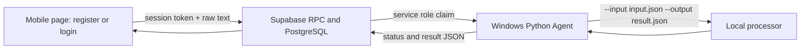

# Free remote submission system

This directory carries the unified learning assistant's original batch-submission workflow over a static mobile console, Supabase storage, and a Windows Python Agent without a VPS.



## Components

- `supabase/migrations/0001_remote_tasks.sql`: user accounts, bcrypt password hashes, sessions, invitation-code consumption, submission table, RLS, receipt-token RPCs, atomic Agent claim, heartbeat, retry, cancel, and execution statistics.
- `supabase/migrations/0002_daily_invitation_codes.sql`: optional Supabase `pg_cron` job that issues 10 new random invitation codes every day at 00:00 Asia/Shanghai.
- `supabase/migrations/0003_admin_accounts.sql`: admin sessions, bootstrap RPC, and protected invitation management RPCs.
- `supabase/migrations/0004_admin_console_and_invitation_rotation.sql`: replaces today's unused codes before issuing 10 fresh codes, retains used-code history, and adds the admin account-list RPC.
- `web/`: mobile-first batch submission and status console for GitHub Pages or Cloudflare Pages.
- `agent/`: standard-library Python Agent for Windows.
- `agent/processor_adapter.py`: the only module that knows how to invoke the local processor.
- `agent/mock_processor.py`: development fixture when the real executable is not available.

## 1. Supabase

1. Create a Supabase Free project.
2. Run `supabase/migrations/0001_remote_tasks.sql`, `supabase/migrations/0002_daily_invitation_codes.sql`, `supabase/migrations/0003_admin_accounts.sql`, then `supabase/migrations/0004_admin_console_and_invitation_rotation.sql` in the Supabase SQL Editor.
3. Record the project URL, public anon key, and service-role key.
4. Keep the service-role key only in `agent/.env` on the Windows computer.

The browser has no direct table permissions. A user must register with a current invitation code or log in. Registration atomically locks and consumes one unused code; a used or expired code cannot register a second account. The browser stores only a random session token and username in local storage, never the password or invitation code. Sessions expire after 30 days. The daily job and the admin `生成 10 个` button both keep 10 currently usable codes by removing only today's unused rows first; used rows remain as history with the consuming account and timestamp. The admin page also lists every registered username, role, registration time, and last login time without returning password hashes.

The database stores only a SHA-256 digest of session and receipt tokens. Submission RPCs require both the session token and receipt token, and check the submission's `user_id` before returning or changing a task.

To issue codes manually, use the SQL Editor or service-role administration path:

```sql
select public.issue_invitation_codes(10);
select code_text
from public.invitation_codes
where issue_date = (timezone('Asia/Shanghai', now()))::date
  and used_at is null
order by created_at;
```

`issue_invitation_codes` is not executable by `anon` or `authenticated`. The daily job runs at `16:00 UTC`, which is `00:00 Asia/Shanghai`.

For a simpler desktop workflow, double-click the Mac launcher or the Windows batch file. On first macOS use, two dialogs ask for the Supabase Project URL and service-role key, then save them to the Agent's local ignored `.env`; later runs go straight to code generation. On Windows, fill the local `.env` first. Both launchers print 10 fresh codes by default; use `--count 20` for another quantity. The service-role key stays on the computer and is never shipped to the mobile page.

Each non-empty input line uses the existing desktop format:

```text
平台 账号 密码 [课程] [单元] [正确率]
```

## 2. Static web

Build with public values:

```sh
cd remote-system/web
SUPABASE_URL=https://PROJECT.supabase.co \
SUPABASE_ANON_KEY=PUBLIC_ANON_KEY \
npm run build
```

The output is `remote-system/web/dist`.

Cloudflare Pages:

```sh
npx wrangler pages deploy dist --project-name unified-task-console
```

For Cloudflare Git integration, set the build command to `npm run build`, output directory to `dist`, root directory to `remote-system/web`, and add `SUPABASE_URL` plus `SUPABASE_ANON_KEY` as build variables.

GitHub Pages is supported by `.github/workflows/deploy-remote-web.yml`. Configure repository secrets `SUPABASE_URL` and `SUPABASE_ANON_KEY`, then run the workflow.

## 3. Windows Agent

Create `remote-system/agent/.env` from the keys in `remote-system/.env.example`. The default real processor setting is:

```dotenv
PROCESSOR_COMMAND_JSON=["my-program.exe"]
```

For the included fixture:

```dotenv
PROCESSOR_COMMAND_JSON=["python","mock_processor.py"]
```

Validate and run:

```bat
check_agent.bat
run_agent.bat
```

Install automatic startup from PowerShell:

```powershell
Set-ExecutionPolicy -Scope Process Bypass
.\install_startup.ps1
```

The scheduled task starts at user logon, restarts after failures, and uses a stable `AGENT_ID`. A processing task remains in Supabase while the computer is off. After its heartbeat lease expires, the restarted Agent claims and processes it again.

## Processor contract

The adapter creates a separate directory for each task attempt and invokes:

```text
my-program.exe --input input.json --output result.json
```

`input.json` preserves one phone submission as a batch:

```json
{
  "submission_id": "uuid",
  "raw_text": "u校园 account password course 1,2,3 90",
  "line_count": 1,
  "attempt_count": 1
}
```

The processor must exit with code `0` and write valid UTF-8 JSON to `result.json`:

```json
{
  "execution_status": "completed",
  "task_total": 1,
  "task_completed": 1,
  "task_failed": 0,
  "result_message": "执行完成"
}
```

`execution_status` accepts `completed`, `partial`, `needs_action`, or `failed`. Stdout and stderr stay in the local attempt directory and are not uploaded. Replace only `PROCESSOR_COMMAND_JSON` when the real program becomes available.

## Tests

```sh
python3 -m unittest discover -s remote-system/agent/tests -v
python3 -m unittest discover -s remote-system/tests -v
npm test --prefix remote-system/web
```
